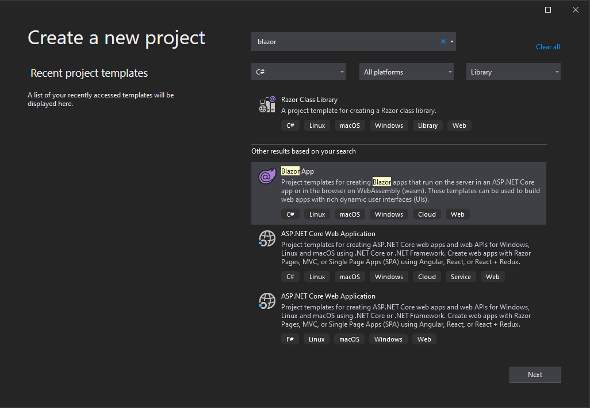
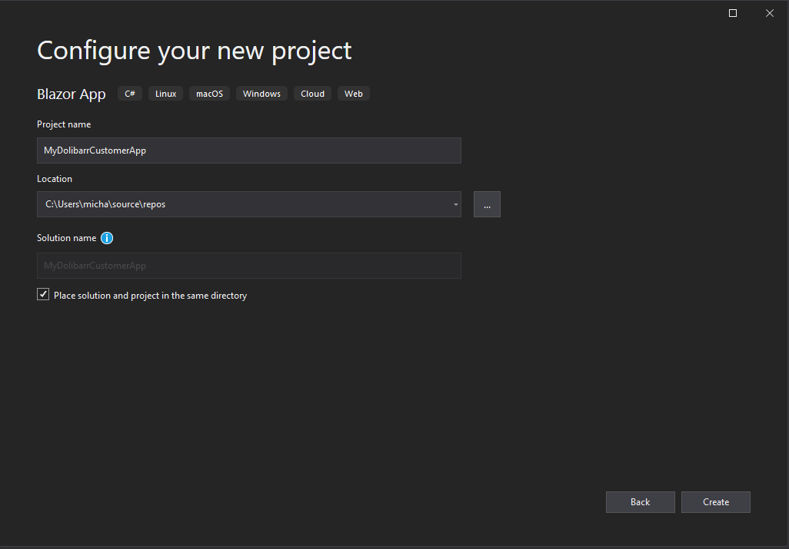
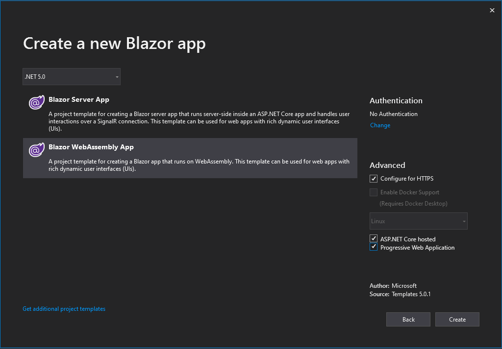
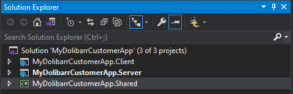

# Setup

In this session, you'll get started building an Dolibarr-connected website app using Blazor. 
The app will enable users to : 
- Create a new Customer (Third-Party) 
- Create a new Contact/User for a Customer
- Login
- View Company info
- View products by category
- Order products
- See order history

## Starting point

To get started, you'll need to start a new Blazor Web Assembly project from Visual Studio 2019.

> Note: Blazor Web Assembly has been shipped for production with the launch of .Net 5. Make sure you have the latest version of Visual Studio before you start.

Go ahead and create a new Blazor Project:





###### But why did we check the ASP.NET Core hosted option?
This tells the project that we want to have a Server Project in our solution. This is a better solution for handling security and API calls. 

###### And why did we check the Progressive Web Application option?
This option offers the client the possibility of installing this Web app as a Desktop or Mobile application. For more info on PWA, check out this link.

Once you hit Create, you'll end up with a solution that looks something like this : 



Here's a definition of each project under your newly created solution : 
- **MyDolibarrCustomerApp.Client**: This is the Blazor project. It contains the UI components for the app.
- **MyDolibarrCustomerApp.Server**: This is the ASP.NET Core project hosting the Blazor app and also the backend services for the app.
- **MyDolibarrCustomerApp.Shared**: This project contains the shared model types for the app.


The **MyDolibarrCustomerApp.Server** project should be set as the startup project.

## Create the layout

Layouts in Blazor are also components. They inherit from `LayoutComponentBase`, which defines a `Body` property that can be used to specify where the body of the layout should be rendered. The main layout component for website is defined in the client project under *Shared/MainLayout.razor*.

We are going to create a seperate layout for the connection pages (login/register user/register client). 
Let's go ahead and add a Razor component to the Client project named LoginLayout.razor under the shared folder (*Shared/LoginLayout.razor*). 

```
@inherits LayoutComponentBase

<div class="col-12">
    <br /><br />
    @Body
</div>
```

To see how the layout is associated with your pages, look at the `<Router>` component in `App.razor`. Notice that the `DefaultLayout` parameter determines the layout used for any page that doesn't specify its own layout directly.

You can also override this `DefaultLayout` on a per-page basis. To do so, you can add a directive such as `@layout SomeOtherLayout` at the top of any `.razor` page component. 

To demonstrate this, we are going to create a child layout to this `LoginLayout.razor`. 

Let's create a new razor components under the same folder named `CenteredCardLayout.razor`. : 

```html
@layout LoginLayout
@inherits LayoutComponentBase

<center>
    <div class="col-8 card">
        <div class="col-12 row">
            <p>&nbsp;</p>
        </div>
        <div class="col-12 row">
            <div class="col-6" style="border-right:groove">
                
            </div>
            <div class="col-6" style="border-left:thick">
                @Body
            </div>
        </div>
        <div class="col-12 row">
            <p>&nbsp;</p>
        </div>
    </div>
</center>
```

As you can see, this layout uses a logo in the `wwwroot/img/` folder. But this image doesn't exists, nor the folder! You may go ahead and create the folder. You may also save the logo that you desired under this freshly created folder. If you image has a different name or exentesion, make sure you update `CenteredCardLayout.razor`. 

###### TODO : ADD CSS 

### Understanding navigation
While we are working with layouts, let's have a look at what's inside `NavMenu.razor`. 

```html
<div class="top-row pl-4 navbar navbar-dark">
    <a class="navbar-brand" href="">MyDolibarrCustomerApp</a>
    <button class="navbar-toggler" @onclick="ToggleNavMenu">
        <span class="navbar-toggler-icon"></span>
    </button>
</div>

<div class="@NavMenuCssClass" @onclick="ToggleNavMenu">
    <ul class="nav flex-column">
        <li class="nav-item px-3">
            <NavLink class="nav-link" href="" Match="NavLinkMatch.All">
                <span class="oi oi-home" aria-hidden="true"></span> Home
            </NavLink>
        </li>
        <li class="nav-item px-3">
            <NavLink class="nav-link" href="counter">
                <span class="oi oi-plus" aria-hidden="true"></span> Counter
            </NavLink>
        </li>
        <li class="nav-item px-3">
            <NavLink class="nav-link" href="fetchdata">
                <span class="oi oi-list-rich" aria-hidden="true"></span> Fetch data
            </NavLink>
        </li>
    </ul>
</div>

@code {
    private bool collapseNavMenu = true;

    private string NavMenuCssClass => collapseNavMenu ? "collapse" : null;

    private void ToggleNavMenu()
    {
        collapseNavMenu = !collapseNavMenu;
    }
}
```

The `NavLink` component is provided by Blazor. Components can be used from components by specifying an element with the component's type name along with attributes for any component parameters.

The `NavLink` component is the same as an anchor tag, except that it adds an `active` class if the current URL matches the link address. `NavLinkMatch.All` means that the link should be active only when it matches the entire current URL (not just a prefix). We'll examine the `NavLink` component in more detail in a later session.

We could replace the text in the upper left corner of our site with a the logo of the company.
We could also remove the unnecessary links coming from the Blazor Template so that the file looks like this : 

```html
<div class="top-row pl-4 navbar navbar-dark">
    
    <button class="navbar-toggler" @onclick="ToggleNavMenu">
        <span class="navbar-toggler-icon"></span>
    </button>
</div>

<div class="@NavMenuCssClass" @onclick="ToggleNavMenu">
    <ul class="nav flex-column">
        <li class="nav-item px-3">
            <NavLink class="nav-link" href="" Match="NavLinkMatch.All">
                <span class="oi oi-home" aria-hidden="true"></span> Home
            </NavLink>
        </li>
    </ul>
</div>

@code {
    private bool collapseNavMenu = true;

    private string NavMenuCssClass => collapseNavMenu ? "collapse" : null;

    private void ToggleNavMenu()
    {
        collapseNavMenu = !collapseNavMenu;
    }
}
```

Right! So we have our layout components created! Let's jump right off to the creation of our 3 connection pages : 
- Connection
- Register
- Register Client


Next up - [Customize a pizza](02-customize-a-pizza.md)
